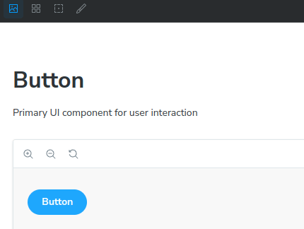

# Storybook Addon Stylesheet Toggle

The Storybook Stylesheet Toggle Plugin is a simple and convenient tool for changing stylesheets on the fly within your Storybook stories. It allows you to dynamically switch between different stylesheets using a dropdown menu accessed via a toolbar button.




## Usage

### Setting Stylesheets

You can specify the stylesheets you want to toggle in your story using the `stylesheetToggle` parameter. This parameter should be an object where each key represents a label for the stylesheet option, and the corresponding value is the path to the stylesheet file or a URL:

```typescript
import type { Preview } from "@storybook/react";

const preview: Preview = {
  parameters: {
    ...
    stylesheetToggle: {
      "default": "main.css",
      "custom-theme": "custom-theme.css",
      "second-custom-theme": "https://second.com/custom-theme.css",
    },
    ...
  },
};

export default preview;

```


## Using the Toggle
Once you've configured your story, you'll see a toolbar button in Storybook that allows you to select and apply different stylesheets to your components during development.
