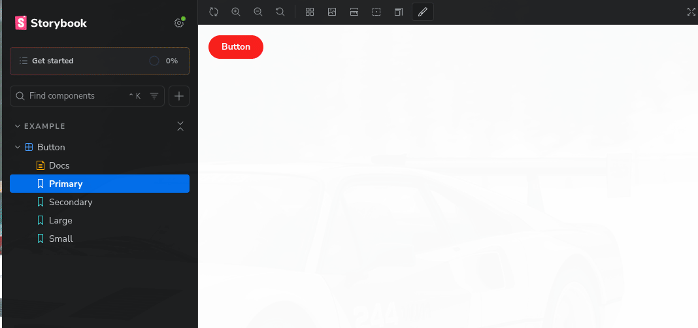

# Storybook Stylesheet Toggle addon

The Storybook Stylesheet Toggle addon is a simple and convenient tool for managing stylesheets in your Storybook stories. Switch between configured stylesheets and dynamically add custom ones at runtime via a dropdown menu in the toolbar.



## Installation

```bash
npm install --save-dev @stevendejong/storybook-stylesheet-toggle
```

Add the addon to your `.storybook/main.ts`:

```typescript
export default {
  addons: [
    '@stevendejong/storybook-stylesheet-toggle',
  ],
};
```

## Usage

### Setting Stylesheets

You can specify the stylesheets you want to toggle in your story using the `stylesheetToggle` parameter. This parameter should be an object where each key represents a label for the stylesheet option, and the corresponding value is the path to the stylesheet file or a URL:

```typescript
import type { Preview } from "@storybook/react";

const preview: Preview = {
  parameters: {
    ...
    stylesheetToggle: {
      "default": "main.css",
      "custom-theme": "custom-theme.css",
      "second-custom-theme": "https://second.com/custom-theme.css",
    },
    ...
  },
};

export default preview;

```


## Using the Toggle
Once you've configured your story, you'll see a toolbar button in Storybook that allows you to select and apply different stylesheets to your components during development.

### Adding Custom Stylesheets

In addition to configured stylesheets, you can dynamically add custom stylesheets at runtime:

1. Click the paint brush toolbar button
2. Enter a stylesheet URL in the input field at the top:
   - Relative paths: `./theme.css`, `/assets/theme.css`
   - Absolute URLs: `https://example.com/styles/theme.css`
3. Press Enter or click "Add"

**Features:**
- ✅ Custom stylesheets persist across browser sessions
- ✅ Delete custom stylesheets with the trash icon
- ✅ URL validation (must end with `.css`)
- ✅ Duplicate detection
- ✅ Auto-naming from URL (e.g., `theme.css`)
- ✅ Visual separation from configured stylesheets

**Example workflow:**
1. Open Storybook
2. Click paint brush icon
3. Add custom stylesheet: `https://cdn.example.com/dark-theme.css`
4. Stylesheet appears in "Custom Stylesheets" section
5. Switch between custom and configured stylesheets
6. Delete custom stylesheets when no longer needed

**localStorage Storage:**
- Selected stylesheet: `localStorage.getItem('stylesheetToggle')`
- Custom stylesheets: `localStorage.getItem('stylesheetToggle:custom')`
